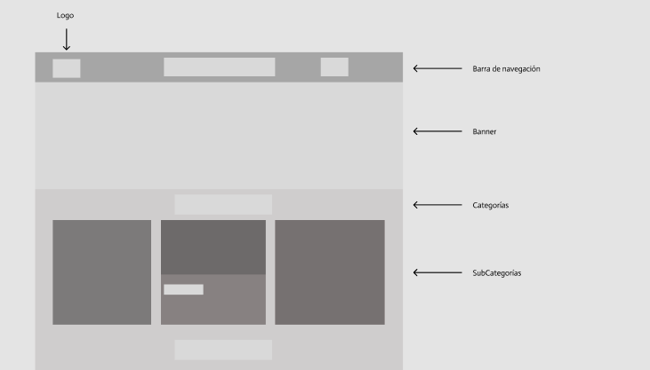
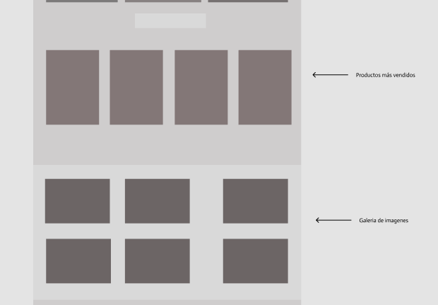
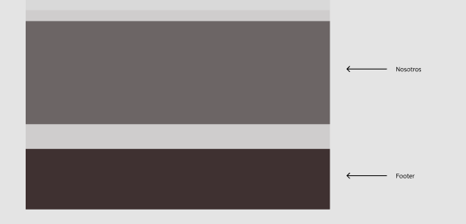
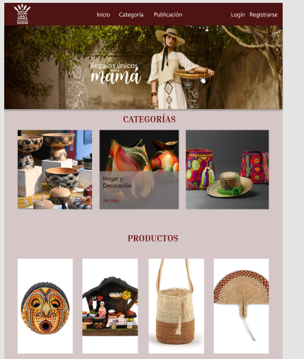
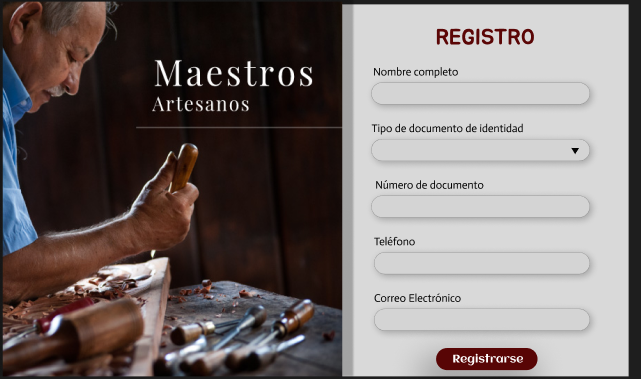
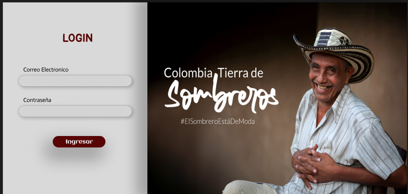

<h1 style="text-align:center;">Ventana Artesanal </h1>
<h3 style="text-align:center;">Autores: </h3>

Daniela Riascos Muñoz

Alejandro Barona 

Miguel Angel Aguirre

Jefferson Rodriguez

Harrison

Libardo Javier Tapia 

 
<h3 style="text-align:center;"> Instructor: </h3>

 Warner Fernando Valencia

Boopcam Talento Tech

2025

## Contenido 

1.  Introducción

2.  Objetivos

    2.1 Generales

    2.2 Objetivos Específicos

 
1 . Introducción
 -

La creación de espacios digitales accesibles se ha convertido en una
necesidad clave para fortalecer la economía local y promover la
visibilidad de productos hechos a mano con identidad cultural. Muchos
artesanos y emprendedores enfrentan barreras para dar a conocer y
comercializar sus productos, lo que limita su crecimiento y
sostenibilidad.

En respuesta a esta problemática, este proyecto propone el desarrollo de
una vitrina artesanal digital: un sitio web especialmente diseñado para
que artesanos y pequeños productores puedan publicar sus productos
directamente al público y añadir información detallada sobre sus
productos (nombre, precio, descripción e imágenes), de manera sencilla.

Además, el sitio contará con una interfaz amigable para los usuarios,
categorización de productos por tipo o temática, y opciones de contacto
para facilitar la comunicación entre clientes y artesanos.

A través de esta iniciativa, se busca proporcionar una herramienta
moderna y funcional que contribuya a ampliar el alcance comercial de los
productores locales, fomentar el consumo responsable y culturalmente
consciente, y preservar el valor artístico y tradicional de sus
creaciones

2 . Objetivos
-

###  Generales:

Crear un sitio web que muestre productos artesanales locales organizados
por categoría, con nombre, precio e imagen, e incluya un formulario para
que nuevos artesanos postulen sus productos.

### Objetivos Específicos:

-   Diseñar una interfaz atractiva e interactiva para la exhibición de
    productos.

-   Implementar un formulario de publicación para que los artesanos
    puedan subir sus productos.

-   Implementar una nueva pestaña para que los artesanos vean sus
    productos publicados.

### Alcance:

El presente proyecto abarca el desarrollo de un sitio web orientado a la
exhibición de productos artesanales locales, permitiendo también la
publicación de nuevos productos por parte de artesanos. El alcance se
delimita a las siguientes funcionalidades:

-   **Diseño e implementación del sitio web** con una interfaz
    visualmente atractiva y fácil de navegar, optimizada para
    dispositivos móviles y escritorio.

-   **Exhibición de productos organizados por categorías**, mostrando
    información clave como nombre del producto, precio, descripción e
    imagen representativa.

-   **Formulario de publicación** que permitirá a los artesanos subir
    información de nuevos productos.
 

 ## Requerimientos Funcionales:

**Visualización de productos:**

-   El sistema debe mostrar productos artesanales organizados por
    categorías.

-   Cada producto debe incluir nombre, precio, descripción, categoría,
    calificación e imagen.

**Formulario de publicación:**

-   El sistema debe permitir a artesanos publicar productos mediante un
    formulario.

-   El formulario debe incluir campos como: nombre del producto,
    categoría, precio, descripción e imagen.

**Formulario de Registro**

- El sistema debe capturar los datos del registro del vendedor y mostrar los datos
  

**Visualización de datos:**

-   El sistema debe capturar los datos y guardarlos para luego subir y
    visualizar el producto ingresado

**Implementación modo oscuro**
 
- Al presionar el icono se activa el modo oscuro

**Recursos Iniciales:** 

-   Herramientas de diseño web (HTML, CSS, JavaScript). 

 **Tecnologías Utilizadas**:

-   HTML5

-   CSS3 (Flexbox, Grid, Media Queries)

-   JavaScript (DOM Manipulation, Form Validation)

-   Git & GitHub

 

## Diseño UI/UX

- Diseño de la interfaz de usuario:

Imagen 1 (Wireframe) Index
-

Imagen 2
-

Imagen3
-

Inicio
-

Registro
-

 Login
  -

<h1 style="text-align:center;"> Conclusión </h1>

El proyecto Ventana Artesanal se presenta como una solución digital para
visibilizar productos artesanales locales, facilitando la interacción
entre artesanos y clientes potenciales a través de un sitio web dinámico
y atractivo. A lo largo del desarrollo, se implementarán funcionalidades
clave como la exhibición de productos por categoría, un formulario de
publicación para nuevos artesanos y un formulario de registro para
vendedores. De esta forma, se espera contribuir al fortalecimiento de la
economía local, promoviendo el consumo consciente y la preservación del
valor cultural de los productos hechos a mano.

